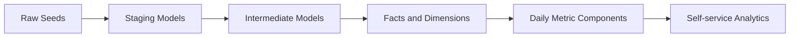

# Trusted E-commerce Metrics

Analytics Engineering portfolio project that turns raw e-commerce events and transactions into tested dbt marts, governed metrics, and self-service-ready analytical assets.

## Why This Project Exists

Business teams often disagree on core e-commerce metrics because raw event data is queried directly and metric logic is reimplemented in dashboards. This project models a small but complete analytics engineering workflow:

```text
raw seed data
  -> staging cleanup
  -> reusable intermediate transformations
  -> contracted facts and dimensions
  -> governed metric components
  -> portfolio evidence
```

The implementation is intentionally local-first with DuckDB so the full project can be reproduced quickly without cloud setup. The modeling approach is designed to map cleanly to a future BigQuery/GA4 implementation.

## What It Demonstrates

- dbt project structure with staging, intermediate, and marts layers.
- Kimball-style facts and dimensions with explicit grains.
- 30-minute inactivity-based sessionization.
- Order-to-session attribution that aligns revenue-by-channel metrics with recomputed sessions where possible.
- Event deduplication in the staging layer.
- Metrics layer design for GMV, orders, active users, conversion rate, AOV, repeat purchase rate, new vs returning users, and revenue by channel.
- Additivity-aware aggregate design that stores numerators and denominators instead of precomputed ratios.
- Enforced marts-layer dbt contracts with complete column names and data types.
- Defensive data quality tests and business assertion tests.
- dbt docs generation and GitHub-renderable lineage evidence.
- GitHub Actions CI for repeatable dbt seed, run, test, and docs generation.

## Architecture



Implemented assets:

- `stg_events`, `stg_orders`, `stg_order_items`, `stg_products`, `stg_users`
- `int_user_sessions`, `int_order_items_enriched`, `int_order_session_attribution`
- `dim_users`, `dim_products`, `fact_orders`, `fact_sessions`
- `agg_daily_ecommerce_metrics`

Current data volume:

- `raw_users`: 30 rows
- `raw_products`: 24 rows
- `raw_orders`: 110 rows
- `raw_order_items`: 221 rows
- `raw_events`: 661 rows, including duplicate event IDs for deduplication testing

## Metric Governance

`agg_daily_ecommerce_metrics` is stored at `metric_date + traffic_source`. It intentionally stores additive components:

- `converted_sessions` and `total_sessions` for conversion rate
- `gmv_amount` and `valid_order_count` for AOV
- `repeat_purchasing_users` and `purchasing_users` for repeat purchase rate

Final ratio metrics are calculated at query time so BI users do not accidentally average daily percentages across incompatible denominators.

See:

- [Metrics Definition](docs/metrics_definition.md)
- [Metric Layer Design](docs/metric_layer_design.md)
- [Analytics Engineering Decisions](docs/analytics_engineering_decisions.md)

## Data Contracts and Tests

The marts layer uses enforced dbt contracts:

- `dim_users`
- `dim_products`
- `fact_orders`
- `fact_sessions`
- `agg_daily_ecommerce_metrics`

The test suite covers primary keys, foreign keys, accepted values, non-null rules, metric component validity, fact-to-aggregate reconciliation, dimension-to-fact reconciliation, and business rules for orders and sessions.

Latest validation:

```text
dbt seed: PASS=5 WARN=0 ERROR=0
dbt run:  PASS=13 WARN=0 ERROR=0
dbt test: PASS=158 WARN=0 ERROR=0
dbt docs generate: completed successfully
```

See [Data Contracts](docs/data_contracts.md).

## Evidence

- [dbt Lineage](docs/lineage.md)
- [Test Results Summary](docs/assets/test_results_summary.md)
- [Channel Metrics Snapshot](docs/assets/channel_metrics_snapshot.md)
- [Portfolio Evidence Checklist](docs/portfolio_evidence.md)

Example metric query:

```sql
select
    traffic_source,
    sum(gmv_amount) as gmv,
    sum(valid_order_count) as valid_orders,
    sum(converted_sessions) * 1.0 / nullif(sum(total_sessions), 0) as conversion_rate,
    sum(gmv_amount) / nullif(sum(valid_order_count), 0) as average_order_value
from analytics.agg_daily_ecommerce_metrics
group by 1
order by gmv desc;
```

## Run Locally

Install `uv`, create the virtual environment, and install dependencies:

```bash
curl -LsSf https://astral.sh/uv/install.sh | sh
uv venv --python 3.10
source .venv/bin/activate
uv pip install -r requirements.txt
```

Build and test the warehouse. The script creates a local ignored `profiles.yml` from `profiles.example.yml` if needed:

```bash
./run_project.sh
```

Generate docs:

```bash
dbt docs generate --profiles-dir .
dbt docs serve --profiles-dir . --port 8080
```

## BigQuery Migration Path

This project does not claim zero-code migration from DuckDB to BigQuery. The stable parts are the metric definitions, model grains, contracts, tests, and mart interfaces. The expected migration work is concentrated in source and staging models, especially GA4 nested field extraction with `event_params` and `items`.

See [BigQuery Migration Notes](docs/bigquery_migration.md).

## v2 Design Review

The v2 iteration adds an attribution bridge so revenue by channel no longer has to blindly trust order-level source fields when a recomputed converting session is available. See [v2 Design Review](docs/v2_design_review.md).

## Portfolio Positioning

This is a portfolio-scale analytics engineering project, not a production deployment. It is built to demonstrate how I think about data quality, metric governance, semantic-layer readiness, and trustworthy self-service analytics.
