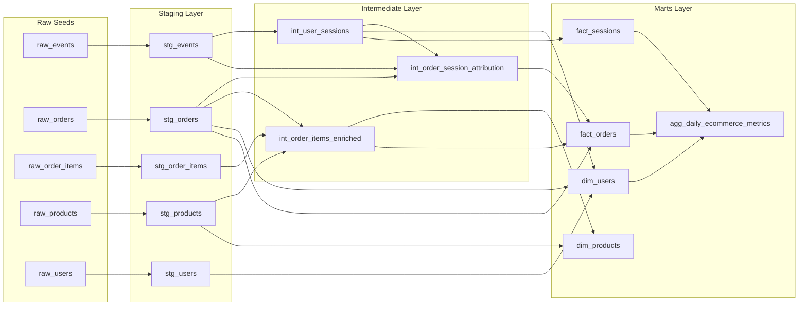

# dbt Lineage

This page provides a GitHub-renderable lineage view for the project. The generated dbt docs site also contains an interactive lineage graph after running `dbt docs generate`.

## How to Read This Graph

- Raw seeds simulate GA4-like e-commerce events and transaction data.
- Staging models standardize field names, types, and source-specific cleanup.
- Intermediate models hold reusable transformations such as 30-minute sessionization, enriched order items, and order-to-session attribution.
- Marts expose contracted facts, dimensions, and additive metric components.
- `agg_daily_ecommerce_metrics` is intentionally downstream of facts and dimensions so metric components reconcile back to trusted marts.
